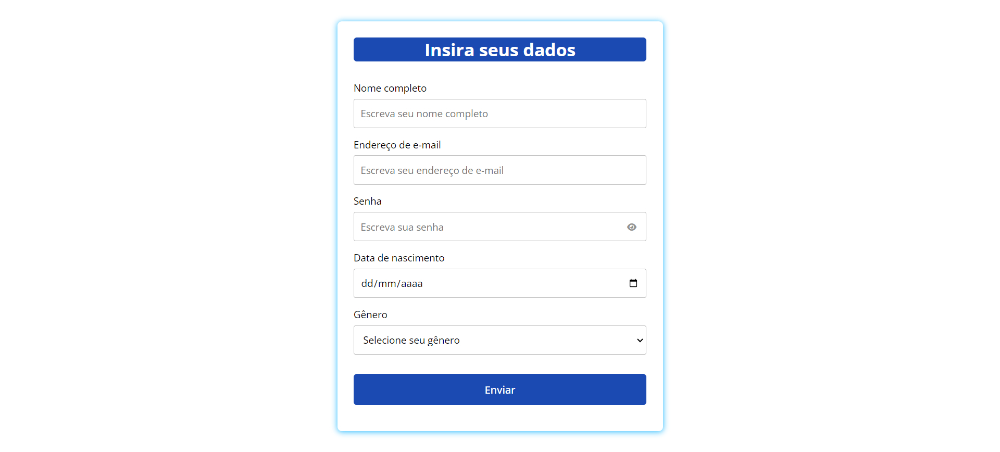
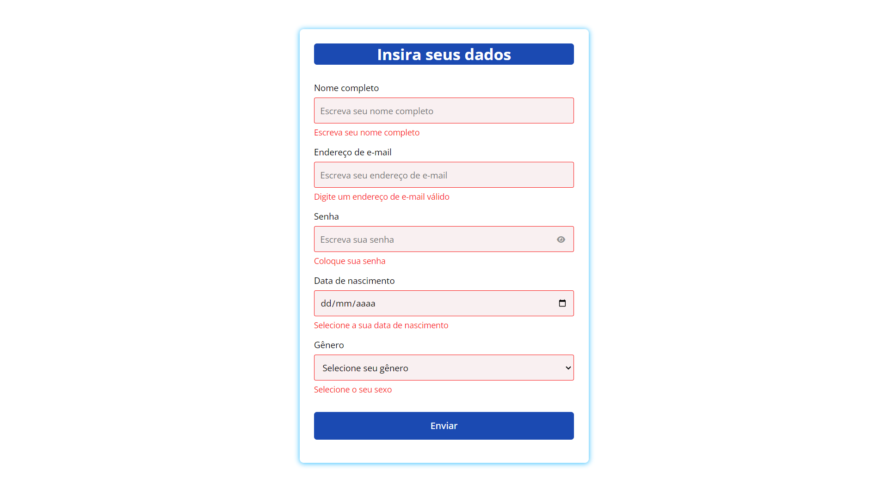

<b>Formulário de login com envio de dados</b>

&nbsp;
&nbsp;
&nbsp;

Este formulário incorpora campos essenciais, incluindo usuário, senha, email, dados de nascimento e gênero, proporcionando uma experiência completa de registro e autenticação. são incluídos para nome de usuário, senha, email e dados de nascimento. - Ícones de opções são utilizados para permitir a escolha do gênero e das datas. - Um botão é adicionado para acionar o envio do formulário.

<a href="https://submitloginform.netlify.app/" target="_blank"><strong>Demonstração ao vivo</strong></a>

 

<b>Características</b>

Validação de campos em tempo real: 

Implementa verificações para nome completo, endereço de e-mail, senha, data de nascimento e seleção de gênero, garantindo que todas as entradas sejam válidas antes de permitir o envio do formulário.

Feedback visual para erros: 

Fornece feedback imediato e visível quando os dados inseridos em um campo não atendem aos critérios de validação estabelecidos, como endereços de e-mail inválidos ou campos obrigatórios não preenchidos.

Estilos modernos e responsivos: 

Utiliza CSS para criar uma interface de usuário limpa e moderna, que é responsiva e se adapta a diferentes tamanhos de tela, proporcionando uma experiência consistente em desktops e dispositivos móveis.

Interação Aprimorada: 

Inclui um botão para alternar a visibilidade da senha, permitindo aos usuários verificar sua entrada sem comprometer a segurança.

<b>Tecnologias utilizadas</b>

HTML5: Estrutura a forma do formulário, garantindo semântica e acessibilidade.

CSS3: 

Estiliza o formulário, incluindo responsividade e animações para uma interação mais dinâmica e agradável.

JavaScript: 

Adiciona interatividade ao formulário, permitindo a validação de campos em tempo real e outras interações dinâmicas.

<b>Licença:</b>

Este projeto está licenciado sob a [LICENSE](LICENSE).

<b>Contato:</b>

Se você tiver alguma dúvida, sugestão ou interesse em colaborar, não hesite em me contatar.

Email: <a href="mailto:danielportela.ti@gmail.com">danielportela.ti@gmail.com</a>

 
 
